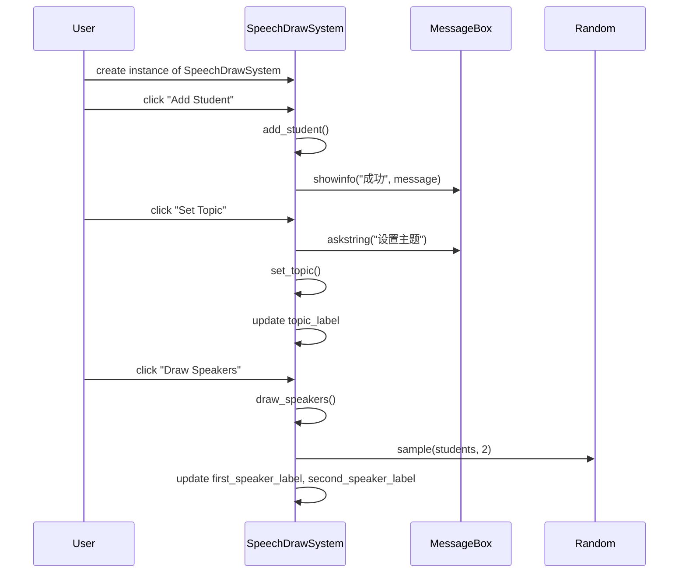

```mermaid
sequenceDiagram
    participant U as User
    participant SD as SpeechDrawSystem
    participant M as MessageBox
    participant R as Random
    U ->> SD: create instance of SpeechDrawSystem
    U ->> SD: click "Add Student"
    SD ->> SD: add_student()
    SD ->> M: showinfo("成功", message)
    U ->> SD: click "Set Topic"
    SD ->> M: askstring("设置主题")
    SD ->> SD: set_topic()
    SD ->> SD: update topic_label
    U ->> SD: click "Draw Speakers"
    SD ->> SD: draw_speakers()
    SD ->> R: sample(students, 2)
    SD ->> SD: update first_speaker_label, second_speaker_label
```