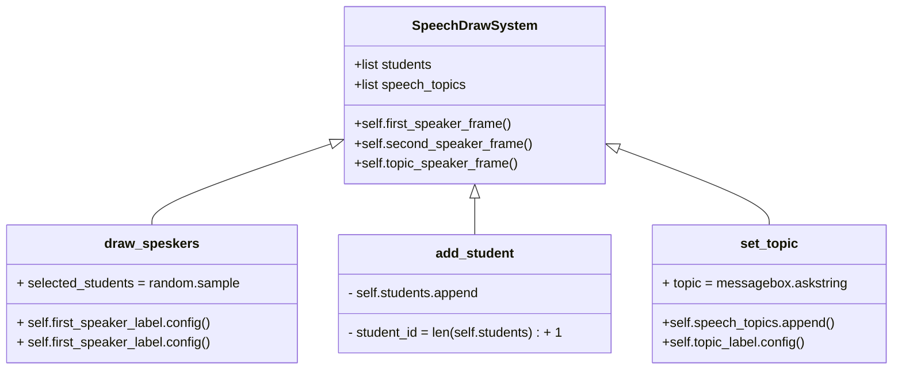

```mermaid
classDiagram
    SpeechDrawSystem <|-- draw_speskers
    SpeechDrawSystem <|-- add_student
    SpeechDrawSystem <|-- set_topic
    SpeechDrawSystem : +list students
    SpeechDrawSystem : +list speech_topics
    SpeechDrawSystem: +self.first_speaker_frame()
    SpeechDrawSystem: +self.second_speaker_frame()
    SpeechDrawSystem: +self.topic_speaker_frame()
    class draw_speskers{
      + selected_students = random.sample
      + self.first_speaker_label.config()
      + self.first_speaker_label.config()
    }
    class add_student{
      - student_id = len(self.students) + 1
      - self.students.append
    }
    class set_topic{
      + topic = messagebox.askstring
      +self.speech_topics.append()
      +self.topic_label.config()
    }
            
```