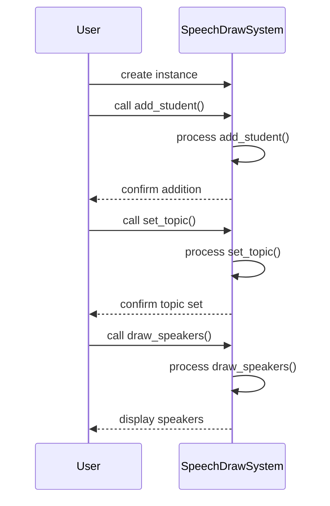

```mermaid
sequenceDiagram
    participant User
    participant SpeechDrawSystem
    User->>SpeechDrawSystem: create instance
    User->>SpeechDrawSystem: call add_student()
    SpeechDrawSystem->>SpeechDrawSystem: process add_student()
    SpeechDrawSystem-->>User: confirm addition
    User->>SpeechDrawSystem: call set_topic()
    SpeechDrawSystem->>SpeechDrawSystem: process set_topic()
    SpeechDrawSystem-->>User: confirm topic set
    User->>SpeechDrawSystem: call draw_speakers()
    SpeechDrawSystem->>SpeechDrawSystem: process draw_speakers()
    SpeechDrawSystem-->>User: display speakers
```