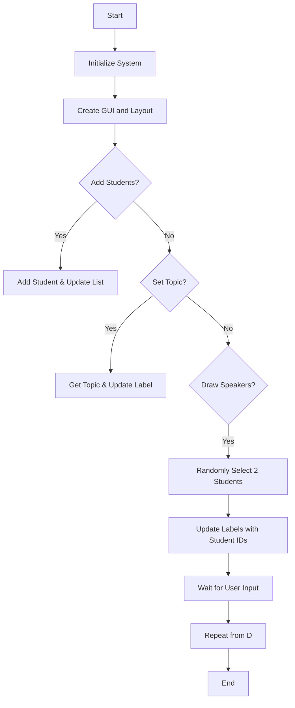

```mermaid
graph TD;
A[Start] --> B[Initialize System];
B --> C[Create GUI and Layout];
C --> D{Add Students?};
D -- Yes --> E[Add Student & Update List];
D -- No --> F{Set Topic?};
F -- Yes --> G[Get Topic & Update Label];
F -- No --> H{Draw Speakers?};
H -- Yes --> I[Randomly Select 2 Students];
I --> J[Update Labels with Student IDs];
J --> K[Wait for User Input];
K --> L[Repeat from D];
L --> M[End];
```