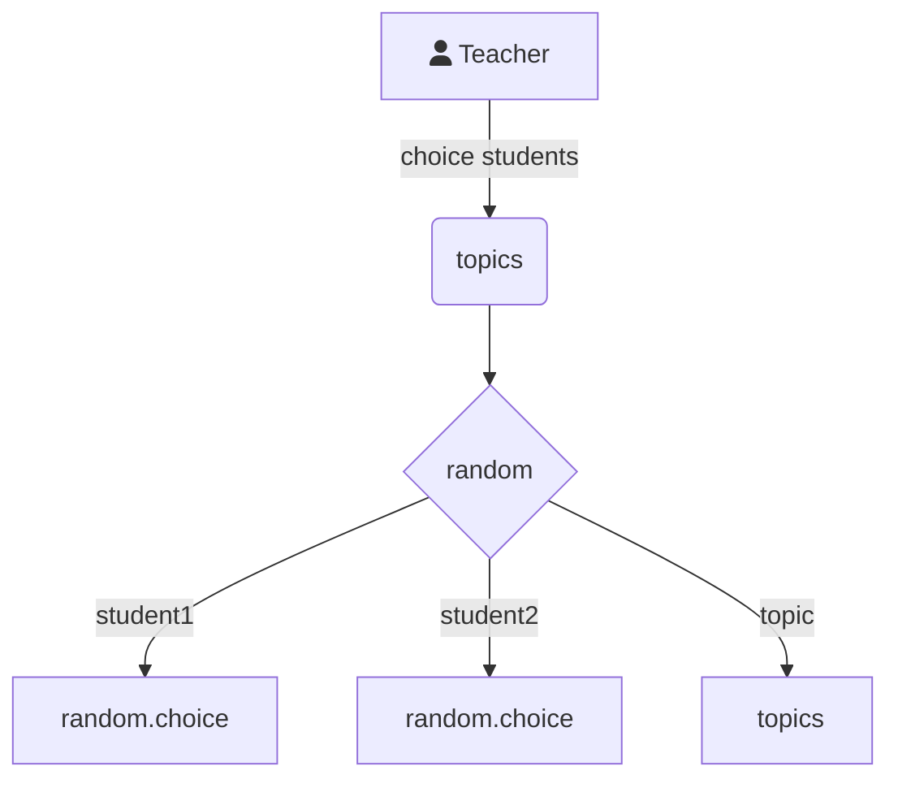

```mermaid
graph TD
    A[fa:fa-user Teacher] -->|choice students| B(topics)
    B --> C{random}
    C -->|student1| D[random.choice]
    C -->|student2| E[random.choice]
    C -->|topic| F[fa:fa-desk topics]
```